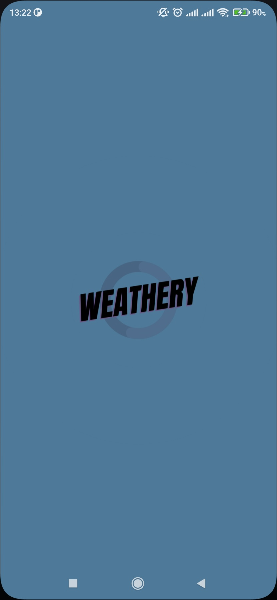
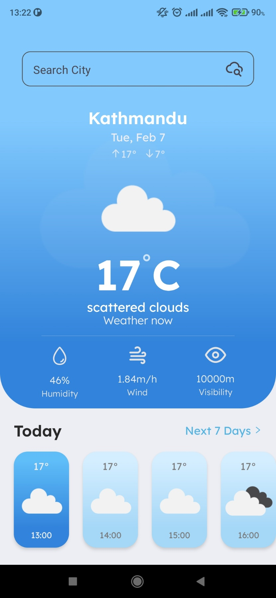
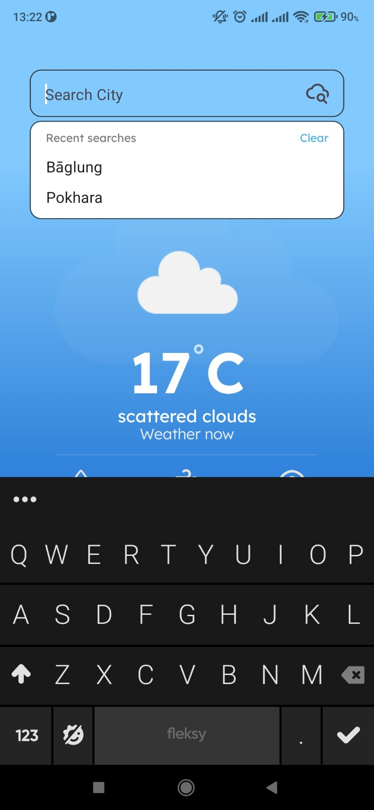
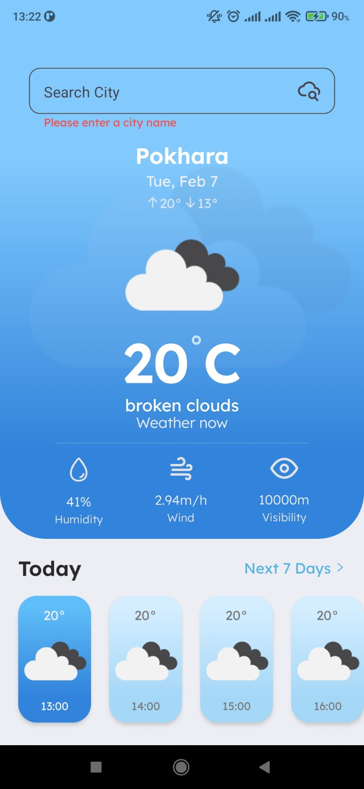
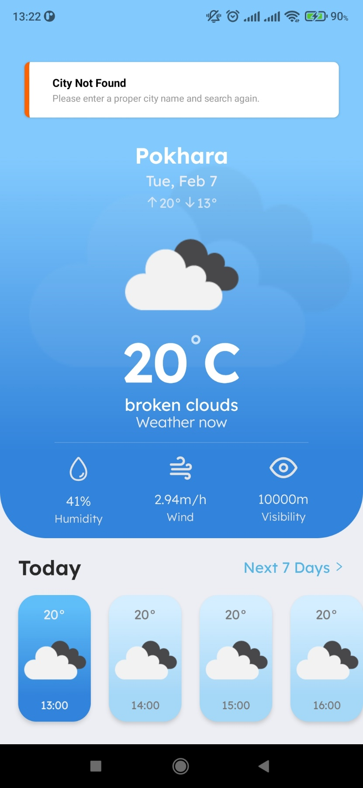
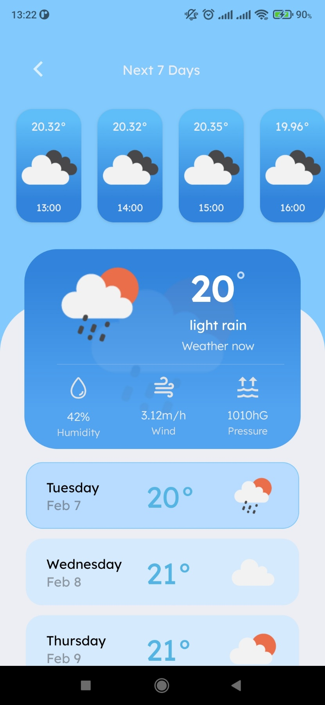

# Weathery

A weather app built using React Native CLI for android on Ubuntu.  
Uses the [openweathermap](https://openweathermap.org/) api for fetching weather data.  
Design inspired from [here](https://www.behance.net/gallery/138332467/Weather-App?tracking_source=search_projects%7Cweather+app).

# Table of Contents

- [App functions](#app-functions)
- [Used API Endpoints](#used-api-endpoints)
- [Editor Setup](#editor-setup)
- [Development Setup](#development-setup)
- [App Screenshots](#app-screenshots)

# App Functions

A user is able to:

- Navigate between two screens _(home and details)_.
- Search for a city's weather data by city name.
- View hourly and daily weather data of searched city.
- View weather data of current city accessed via device location.

# Used API Endpoints

- [Search by lat lon and get city name](https://api.openweathermap.org/data/2.5/weather?lat=27.7172&lon=85.3240&units=metric&appid=id)
- [Search by city name](https://api.openweathermap.org/data/2.5/forecast?q=kathmandu&units=metric&appid=id)
- [Search by lat lon](https://api.openweathermap.org/data/2.5/onecall?lat=27.7172&lon=85.3240&appid=id)

# Editor Setup

- Prettier
- ESLint

# Development Setup

### Prerequisites

- Node.js
- NPM
- Android SDK
- Visual Studio Code

Run following commands from project root directory to get up and running with development.

### 1. Install dependencies

npm install

### 2. Start metro bundler

npx react-native start || npm start

### 3. Build the app on android

npx react-native run android || npm run android

# App Screenshots

